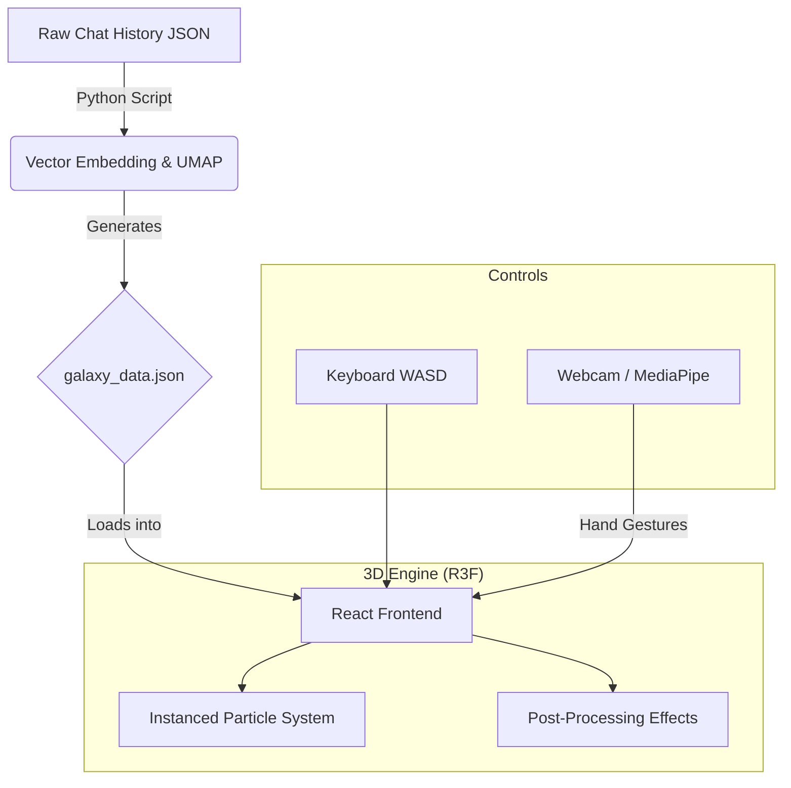

# Neural Galaxy

An immersive 3D visualization of LLM chat history. Travel through your neural galaxy with gesture controls!

> **The Odyssey of Your LLM Chat History**

**Neural Galaxy** transforms your archived conversations with ChatGPT/Claude/Gemini into an interactive **3D Universe**. 

Don't just read your history—fly through it.

[Image of 3D particle data visualization glowing network]

## Features
- **Semantic Star Map**: 10,000+ conversation particles clustered by topic similarity (UMAP + Embeddings).
- **Warp Speed Navigation**: First-person flight controls (WASD) with motion blur.
- **Minority Report Mode**: Hand gesture navigation using MediaPipe.
- **Cyberpunk Aesthetics**: High-performance Bloom, Vignette, and Chromatic Aberration effects.

